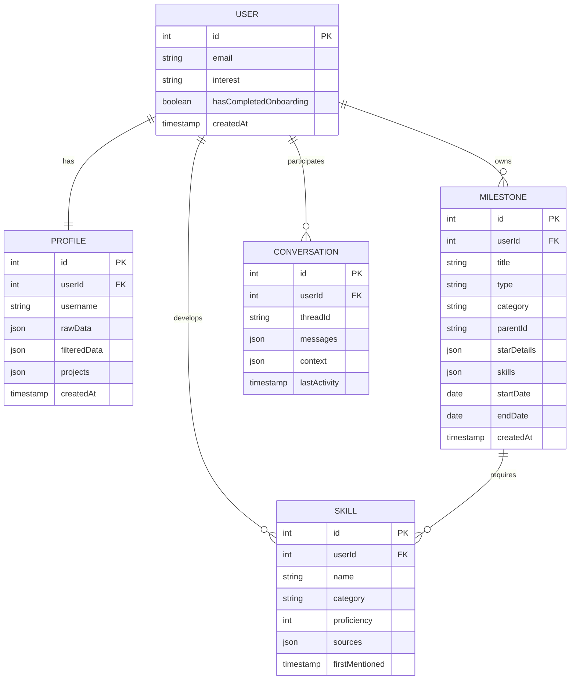

# Product Requirements Document: Journey Canvas Enhancement

## Executive Summary

The Journey Canvas Enhancement project aims to create an intelligent, interactive career visualization platform that combines a dynamic timeline with AI-powered conversations. Users will be able to track their professional journey through an intuitive interface that automatically organizes their experiences, projects, and skills while providing contextual insights through natural language interaction.

## Problem Statement

### Current Challenges
1. **Static Timeline**: Current implementation shows nodes chronologically but lacks interactivity
2. **Disconnected Chat**: AI chat operates independently of the visual timeline
3. **Limited Context**: Welcome messages and conversations lack historical context
4. **Manual Organization**: Users must manually categorize and organize their professional experiences
5. **Skill Tracking Gap**: No systematic capture of skills mentioned in conversations
6. **Navigation Issues**: Difficult to navigate across different time periods and experiences

### User Pain Points
- "I want to update my work at Company X, but I have to scroll through everything"
- "The AI doesn't remember what I talked about last time"
- "I mentioned React skills in multiple conversations but they're not tracked anywhere"
- "I can't see how my side projects relate to my work experience"

## Solution Overview

### Vision
Create a seamless integration between an intelligent AI chat interface and a dynamic, categorized timeline that automatically captures, organizes, and visualizes professional experiences with their associated skills and context.

### Key Features
1. **Dynamic Timeline Navigation**: Timeline responds to conversation context
2. **Contextual AI Chat**: Welcome messages and conversations based on user history
3. **Automatic Skill Extraction**: Real-time skill identification and categorization
4. **Progressive Information Capture**: Flexible questioning based on available time
5. **Smart Node Organization**: Automatic categorization of experiences and projects

## User Stories

### Primary User Personas
1. **Career Progressors**: Professionals tracking advancement in current field
2. **Career Changers**: Individuals transitioning between industries/roles
3. **Job Seekers**: People actively looking for new opportunities
4. **Entrepreneurs**: Those building startups or side businesses

### Core User Stories

#### US1: Dynamic Timeline Navigation
**As a** professional tracking my career
**I want** the timeline to automatically focus on relevant experiences when I mention them in chat
**So that** I can easily update specific parts of my journey without manual navigation

**Acceptance Criteria:**
- When I mention "Google" in chat, timeline scrolls to Google experience node
- Mentioned node expands to show related projects
- Chat context updates to focus on that time period
- Smooth animations provide visual feedback

#### US2: Contextual Welcome Messages
**As a** returning user
**I want** personalized welcome messages based on my previous conversations
**So that** I can quickly resume where I left off

**Acceptance Criteria:**
- Welcome message references last discussed project/company
- Shows days since last update
- Suggests relevant follow-up questions
- Provides quick access to continue previous conversations

#### US3: Automatic Skill Tracking
**As a** professional discussing my work
**I want** my skills to be automatically identified and tracked
**So that** I can build a comprehensive skill inventory without manual entry

**Acceptance Criteria:**
- Technical skills (React, Python, etc.) are automatically extracted
- Soft skills (leadership, communication) are identified
- Skills are categorized (technical, soft, domain, tools)
- Visual indicators show skills on timeline nodes
- Skill summary is available in chat interface

#### US4: Progressive Information Capture
**As a** busy professional with limited time
**I want** to provide updates that match my available time
**So that** I can maintain my journey regardless of schedule constraints

**Acceptance Criteria:**
- AI asks about available time (quick/standard/detailed)
- Question flow adapts to time constraints
- Quick updates capture essential information
- Detailed sessions gather comprehensive STAR stories
- Progress is saved regardless of completion level

#### US5: Smart Project Organization
**As a** professional with diverse experiences
**I want** my projects to be automatically categorized and positioned
**So that** I can see clear relationships between different aspects of my career

**Acceptance Criteria:**
- Work projects appear under relevant employer nodes
- Side projects are visually distinct from work projects
- Volunteering experiences are properly categorized
- Certifications and job searches have dedicated spaces
- Visual connections show skill/experience relationships

## Technical Architecture

### System Components

```
┌─────────────────────┐    ┌─────────────────────┐    ┌─────────────────────┐
│   Frontend (React)  │    │  Backend (Express)  │    │   AI Services       │
├─────────────────────┤    ├─────────────────────┤    ├─────────────────────┤
│ • Timeline Canvas   │    │ • REST API          │    │ • OpenAI GPT        │
│ • Chat Interface    │    │ • WebSocket         │    │ • Mastra Framework  │
│ • Node Components   │    │ • Auth Middleware   │    │ • Skill Extraction  │
│ • Skill Visualizer  │    │ • Data Validation   │    │ • Context Manager   │
└─────────────────────┘    └─────────────────────┘    └─────────────────────┘
           │                           │                           │
           └───────────────────────────┼───────────────────────────┘
                                      │
                      ┌─────────────────────┐
                      │   Data Layer        │
                      ├─────────────────────┤
                      │ • PostgreSQL        │
                      │ • Redis (Cache)     │
                      │ • Qdrant (Vectors)  │
                      └─────────────────────┘
```

### Data Model



## Design Diagrams

### Timeline Layout with Swim Lanes

```
Timeline Scrubber (Top)
┌─────────────────────────────────────────────────────────────────┐
│ 2018    2019    2020    2021    2022    2023    2024    2025    │
│   ●       ●       ●       ●   ▬▬▬●▬▬▬   ●       ●       ●      │
└─────────────────────────────────────────────────────────────────┘
                                   ↑ Current View

Main Timeline (Center)
                        Certifications
                             ●
                             │
Education ●─────● Work ●─────●─────● Current Work
                  │               │
            Work Projects    Work Projects
                  ●               ●
                                  │
                            Side Projects
                                  ●
                                  │
                            Volunteering
                                  ●

Legend:
● Primary Nodes (Education, Work)
● Branch Nodes (Projects, Certifications, etc.)
─ Timeline Connections
│ Branch Connections
```

### Chat-Timeline Interaction Flow

```
┌─────────────────┐
│ User sends      │
│ message about   │
│ "Google work"   │
└─────────┬───────┘
          │
          ▼
┌─────────────────┐     ┌─────────────────┐
│ AI analyzes     │────▶│ Extract context │
│ message for     │     │ • Company: Google│
│ entities        │     │ • Type: Work     │
└─────────────────┘     │ • Time: Past     │
          │             └─────────────────┘
          ▼                       │
┌─────────────────┐              ▼
│ Timeline        │     ┌─────────────────┐
│ navigates to    │◀────│ Send navigation │
│ Google node     │     │ event to        │
└─────────────────┘     │ timeline        │
          │             └─────────────────┘
          ▼
┌─────────────────┐
│ Node expands    │
│ Chat context    │
│ updates to      │
│ Google timeframe│
└─────────────────┘
```

### Skill Extraction Pipeline

```
User Message
     │
     ▼
┌─────────────────┐
│ Text Analysis   │
│ • NLP parsing   │
│ • Entity recog  │
└─────────┬───────┘
          │
          ▼
┌─────────────────┐    ┌─────────────────┐
│ Skill Detection │───▶│ Categorization  │
│ • Technical     │    │ • Technical     │
│ • Soft skills   │    │ • Soft          │
│ • Tools         │    │ • Domain        │
└─────────────────┘    │ • Tools         │
          │            └─────────────────┘
          ▼                      │
┌─────────────────┐              ▼
│ Node Update     │    ┌─────────────────┐
│ • Add skills    │◀───│ Skill Mapping   │
│ • Visual badges │    │ to timeline     │
│ • Skill summary │    │ nodes           │
└─────────────────┘    └─────────────────┘
```

## Implementation Plan

### Phase 1: Core Chat Enhancement (Weeks 1-2)

#### Task 1.1: Merge AI Capabilities
**Priority**: High
**Effort**: 8 points
**Dependencies**: None

**Subtasks**:
- [ ] Remove voice features from both components
- [ ] Port streaming response handling from VoiceChatPanelAI to OverlayChat
- [ ] Integrate with `/api/ai/chat` endpoint
- [ ] Test message flow and error handling

**Acceptance Criteria**:
- Chat uses streaming responses
- No voice-related code remains
- All existing chat functionality preserved
- Error states handled gracefully

#### Task 1.2: Implement Contextual Welcome Messages
**Priority**: High
**Effort**: 5 points
**Dependencies**: Task 1.1

**Subtasks**:
- [ ] Create context detection logic
- [ ] Implement welcome message variations
- [ ] Add last activity tracking
- [ ] Test with different user states

**Acceptance Criteria**:
- Welcome messages reference recent activity
- New users get appropriate onboarding flow
- Returning users see relevant context
- Messages are personalized and helpful

#### Task 1.3: Progressive Information Capture
**Priority**: Medium
**Effort**: 6 points
**Dependencies**: Task 1.1

**Subtasks**:
- [ ] Implement time-based question flows
- [ ] Create question prioritization logic
- [ ] Add conversation state management
- [ ] Test with different time scenarios

**Acceptance Criteria**:
- Users can specify available time
- Question flow adapts to time constraints
- Essential information captured in quick updates
- Detailed information gathered when time allows

### Phase 2: Timeline Enhancement (Weeks 3-4)

#### Task 2.1: Dynamic Timeline Navigation
**Priority**: High
**Effort**: 10 points
**Dependencies**: Task 1.1

**Subtasks**:
- [ ] Implement company/entity detection in chat
- [ ] Create timeline navigation events
- [ ] Add smooth scrolling and animations
- [ ] Implement node highlighting system

**Acceptance Criteria**:
- Timeline automatically scrolls to mentioned entities
- Smooth animations provide visual feedback
- Chat and timeline stay synchronized
- Navigation works for all node types

#### Task 2.2: Smart Node Organization
**Priority**: High
**Effort**: 12 points
**Dependencies**: None

**Subtasks**:
- [ ] Implement swim lane positioning system
- [ ] Create node categorization logic
- [ ] Add branch node management
- [ ] Update connection line rendering

**Acceptance Criteria**:
- Nodes positioned in appropriate swim lanes
- Work projects branch from parent jobs
- Side projects and volunteering have dedicated lanes
- Visual hierarchy is clear and intuitive

#### Task 2.3: Timeline Scrubber
**Priority**: Medium
**Effort**: 8 points
**Dependencies**: Task 2.1

**Subtasks**:
- [ ] Create timeline scrubber component
- [ ] Implement year markers and navigation
- [ ] Add viewport indicator
- [ ] Synchronize with main timeline

**Acceptance Criteria**:
- Scrubber shows current timeline position
- Click navigation works smoothly
- Year markers are accurate
- Responsive to timeline changes

### Phase 3: Skill Tracking System (Weeks 5-6)

#### Task 3.1: Automatic Skill Extraction
**Priority**: High
**Effort**: 10 points
**Dependencies**: Task 1.1

**Subtasks**:
- [ ] Integrate with skill detection API
- [ ] Implement skill categorization
- [ ] Create skill storage system
- [ ] Add skill deduplication logic

**Acceptance Criteria**:
- Skills automatically extracted from conversations
- Proper categorization (technical, soft, domain, tools)
- No duplicate skills stored
- Skills linked to specific conversations/nodes

#### Task 3.2: Skill Visualization
**Priority**: Medium
**Effort**: 6 points
**Dependencies**: Task 3.1

**Subtasks**:
- [ ] Add skill badges to timeline nodes
- [ ] Create skill summary panel
- [ ] Implement skill cloud visualization
- [ ] Add skill filtering capabilities

**Acceptance Criteria**:
- Skills visible on relevant timeline nodes
- Comprehensive skill summary available
- Visual skill cloud shows proficiency levels
- Users can filter timeline by skills

#### Task 3.3: Skill Profile Management
**Priority**: Low
**Effort**: 4 points
**Dependencies**: Task 3.1

**Subtasks**:
- [ ] Allow manual skill editing
- [ ] Add skill proficiency levels
- [ ] Implement skill endorsement system
- [ ] Create skill development tracking

**Acceptance Criteria**:
- Users can edit auto-detected skills
- Proficiency levels are trackable
- Skill development over time is visible
- Export capabilities for skills

### Phase 4: AI Integration Enhancement (Weeks 7-8)

#### Task 4.1: Enhanced Context Management
**Priority**: High
**Effort**: 8 points
**Dependencies**: Task 1.1, 2.1

**Subtasks**:
- [ ] Implement conversation memory system
- [ ] Add cross-session context retention
- [ ] Create context-aware response generation
- [ ] Test context accuracy and relevance

**Acceptance Criteria**:
- AI remembers previous conversations
- Context spans multiple sessions
- Responses are relevant to user's history
- Context doesn't interfere with new topics

#### Task 4.2: Intelligent Node Updates
**Priority**: High
**Effort**: 10 points
**Dependencies**: Task 4.1

**Subtasks**:
- [ ] Implement smart node matching
- [ ] Add automatic node creation
- [ ] Create conflict resolution for ambiguous references
- [ ] Test with various conversation patterns

**Acceptance Criteria**:
- AI correctly identifies which nodes to update
- New nodes created when appropriate
- Ambiguous references are clarified with user
- Updates are accurate and well-placed

#### Task 4.3: Advanced Question Generation
**Priority**: Medium
**Effort**: 6 points
**Dependencies**: Task 4.1

**Subtasks**:
- [ ] Implement context-aware question generation
- [ ] Add follow-up question logic
- [ ] Create question prioritization system
- [ ] Test question relevance and timing

**Acceptance Criteria**:
- Questions are relevant to user's context
- Follow-up questions build on previous answers
- Question priority matches user goals
- Natural conversation flow maintained

### Phase 5: Testing & Refinement (Weeks 9-10)

#### Task 5.1: End-to-End Testing
**Priority**: High
**Effort**: 8 points
**Dependencies**: All previous tasks

**Subtasks**:
- [ ] Create comprehensive test scenarios
- [ ] Test chat-timeline integration
- [ ] Validate skill extraction accuracy
- [ ] Performance testing and optimization

**Acceptance Criteria**:
- All user stories function correctly
- Performance meets requirements
- Error handling is robust
- User experience is smooth and intuitive

#### Task 5.2: User Experience Refinement
**Priority**: High
**Effort**: 6 points
**Dependencies**: Task 5.1

**Subtasks**:
- [ ] Gather user feedback
- [ ] Refine animations and transitions
- [ ] Optimize loading states
- [ ] Polish visual design

**Acceptance Criteria**:
- User feedback is positive
- Animations are smooth and purposeful
- Loading states are informative
- Visual design is cohesive and professional

## Technical Specifications

### API Endpoints

#### Enhanced Chat API
```typescript
POST /api/ai/chat
{
  message: string;
  userId: string;
  threadId?: string;
  existingNodes: Node[];
  userInterest: string;
  profileData: ProfileData;
  timeContext?: {
    availableTime: 'quick' | 'standard' | 'detailed';
    lastActivity: Date;
  };
}

Response: {
  streamId: string;
  // Server-Sent Events follow
}
```

#### Skill Extraction API
```typescript
POST /api/ai/extract-skills
{
  message: string;
  context: {
    nodeId?: string;
    existingSkills: Skill[];
  };
}

Response: {
  skills: {
    technical: string[];
    soft: string[];
    domain: string[];
    tools: string[];
  };
  confidence: number;
  sources: SkillSource[];
}
```

#### Timeline Navigation API
```typescript
POST /api/timeline/navigate
{
  userId: string;
  target: {
    type: 'company' | 'timeframe' | 'skill' | 'project';
    value: string;
  };
}

Response: {
  nodeId: string;
  position: { x: number; y: number };
  relatedNodes: string[];
}
```

### Component Architecture

```
App
├── ProfessionalJourney
│   ├── TimelineScrubber
│   ├── TimelineCanvas
│   │   ├── MilestoneNode[]
│   │   └── ConnectionEdge[]
│   └── OverlayChat
│       ├── MessageList
│       ├── SkillSummary
│       └── InputControls
├── SkillVisualization
│   ├── SkillBadge[]
│   └── SkillCloud
└── ContextManager
    ├── ConversationMemory
    └── NodeMatcher
```

### State Management

```typescript
interface AppState {
  timeline: {
    nodes: Node[];
    edges: Edge[];
    currentView: Viewport;
    activeNode?: string;
  };
  chat: {
    messages: Message[];
    context: ConversationContext;
    isProcessing: boolean;
  };
  skills: {
    userSkills: Skill[];
    recentlyDetected: Skill[];
    categories: SkillCategories;
  };
  user: {
    profile: ProfileData;
    preferences: UserPreferences;
    lastActivity: Date;
  };
}
```

## Success Metrics

### Primary KPIs
1. **User Engagement**
   - Daily active users
   - Session duration
   - Messages per session
   - Timeline interactions per session

2. **Feature Adoption**
   - % of users using contextual chat
   - % of conversations that update timeline
   - Skills extracted per conversation
   - Timeline navigation events per user

3. **Content Quality**
   - Skill extraction accuracy (>85%)
   - Node placement accuracy (>90%)
   - User satisfaction with AI responses (>4.0/5.0)
   - Conversation completion rate (>70%)

### Secondary Metrics
1. **Technical Performance**
   - Chat response time (<2s)
   - Timeline rendering time (<1s)
   - Skill extraction processing time (<500ms)
   - Error rate (<1%)

2. **User Satisfaction**
   - Net Promoter Score (>7.0)
   - User retention rate (>60% monthly)
   - Feature usage rate (>40% of active users)
   - Support ticket volume (<5% of users)

## Risk Assessment

### High Risk
1. **AI Accuracy**: Skill extraction and context understanding may be imperfect
   - **Mitigation**: Implement confidence scoring and user validation flows

2. **Performance**: Large timelines with many nodes may impact performance
   - **Mitigation**: Implement virtualization and lazy loading

3. **User Adoption**: Complex interface may confuse some users
   - **Mitigation**: Comprehensive onboarding and progressive disclosure

### Medium Risk
1. **Data Privacy**: AI processing of personal career information
   - **Mitigation**: Clear privacy policies and data encryption

2. **Scalability**: System may not handle large user volumes
   - **Mitigation**: Performance testing and infrastructure scaling

### Low Risk
1. **Browser Compatibility**: Advanced features may not work on older browsers
   - **Mitigation**: Progressive enhancement and graceful degradation

## Future Enhancements

### Phase 2 Features (Post-MVP)
1. **Voice Integration**: Add speech-to-text and text-to-speech
2. **Collaboration**: Share timeline sections with mentors/peers
3. **Analytics**: Career progression insights and recommendations
4. **Integration**: Connect with LinkedIn, GitHub, and other platforms
5. **Mobile App**: Native mobile experience
6. **AI Coaching**: Proactive career advice and goal setting

### Long-term Vision
- Become the primary platform for career development and tracking
- Integrate with HR systems for performance reviews
- Provide industry benchmarking and career path recommendations
- Support team and organizational career development

---

**Document Version**: 1.0  
**Last Updated**: January 2025  
**Next Review**: February 2025  
**Owner**: Product Team  
**Status**: Ready for Development